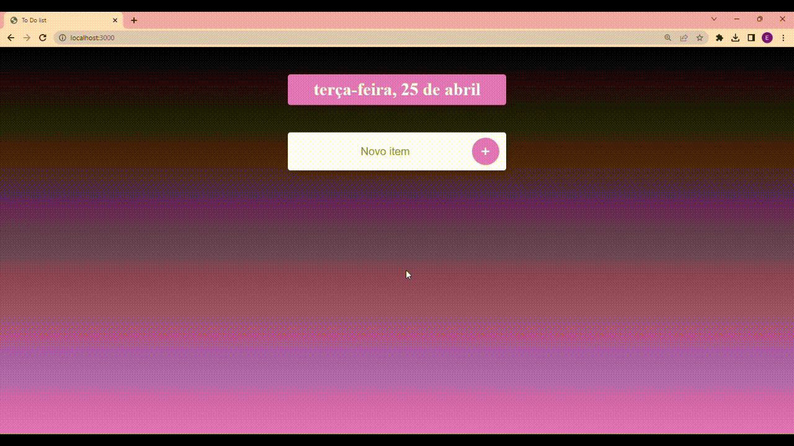

<h1 align="center" >    
  To Do List 
</h1>

<h1 align="center">
  
</h1>

## About 📝

**To Do List** Project developed for EJS studies.

## Tools 🔧

- [Express](https://expressjs.com/)
- [NodeJS](https://nodejs.org/en)
- [EJS](https://ejs.co/)

## How to Setup 👩‍💻

```bash
  # Clone the project
  $ git clone https://github.com/ManuFritzen/ToDoListe_with_EJS.git
```
```bash
  # Install the dependencies, if you use npm
  $ npm install
```
```bash
  # Run the project
  $ npm app.js
```

<p align="center">💖 Done with love and dedication by Emanuelle Fritzen Machado 💖</p>